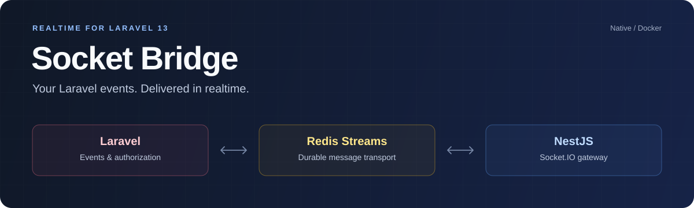

<p align="center"></p>

<p align="center">
<a href="https://github.com/Belysh/laravel-socket-bridge/actions/workflows/ci.yml"></a>


<a href="LICENSE"></a>
</p>

# Socket Bridge for Laravel

Send Laravel events and notifications over WebSockets, authorize subscriptions with channel policies, and handle client commands in PHP. A bundled NestJS / Socket.IO gateway manages connections; Redis Streams carry messages between the gateway and Laravel.

Each Laravel application runs its own bridge, with support for multiple gateway replicas.

[Installation](docs/INSTALLATION.md) · [Socket.IO integration](docs/SOCKET_IO.md) · [Examples](docs/EXAMPLES.md) · [Deployment](docs/DEPLOYMENT.md)

## Requirements

- Laravel 13, PHP 8.3+, and MySQL, PostgreSQL or SQLite.
- Redis 7+ with a Laravel Redis client (`phpredis` or `predis/predis`). Redis Cluster is not supported.
- macOS or Linux for native development; Docker or WSL2 on Windows.

## Installation

```bash
composer require belysh/laravel-socket-bridge:^2.0
php artisan socket-bridge:install
php artisan migrate
```

The installer configures the `socketio` broadcaster and lets you choose how to run the gateway:

- **Native** — uses your Laravel Redis connection and prepares Node 24 automatically.
- **Docker** — requires Docker Compose v2; uses an existing Redis or creates a dedicated Redis service.

Start the gateway and workers alongside your Laravel HTTP server:

```bash
php artisan socket-bridge:dev
```

For native development with `artisan serve`, use `socket-bridge:dev --serve` to start Laravel as well. See the [installation guide](docs/INSTALLATION.md) for Docker, Sail, Herd, Valet and HTTPS setup.

## Broadcast an event

Create `app/Events/OrderUpdated.php`:

```php
namespace App\Events;

use Illuminate\Broadcasting\InteractsWithSockets;
use Illuminate\Broadcasting\PrivateChannel;
use Illuminate\Contracts\Broadcasting\ShouldBroadcast;

class OrderUpdated implements ShouldBroadcast
{
    use InteractsWithSockets;

    public function __construct(public int $orderId, public string $status) {}

    public function broadcastOn(): array
    {
        return [new PrivateChannel('orders.'.$this->orderId)];
    }

    public function broadcastAs(): string
    {
        return 'order.updated';
    }
}
```

Authorize access in `routes/channels.php`. This example assumes the user has an `orders` relationship:

```php
use Illuminate\Support\Facades\Broadcast;

Broadcast::channel('orders.{orderId}', function ($user, int $orderId) {
    return $user->orders()->whereKey($orderId)->exists();
});
```

Dispatch the event from your application:

```php
broadcast(new \App\Events\OrderUpdated($order->id, 'paid'));
```

`ShouldBroadcast` sends through Laravel's queue, which `socket-bridge:dev` runs for you. Use `ShouldBroadcastNow` for immediate dispatch.

## Receive it with Socket.IO

```bash
npm install socket.io-client
```

Connect to your gateway and request connection tickets from your Laravel API. Replace the example URLs with your own.

The example uses `authHeaders` from your application's existing login flow. With the default Laravel session authentication, include the current CSRF token as `X-CSRF-TOKEN`; for bearer authentication, use an `Authorization` header and [configure the matching Laravel guard](docs/EXAMPLES.md#sanctum-bearer-authentication).

```js
import { io } from 'socket.io-client';

const socket = io('https://realtime.example.com', {
  transports: ['websocket'],
  auth: async done => {
    try {
      const response = await fetch('https://api.example.com/socket-bridge/token', {
        method: 'POST',
        credentials: 'include',
        signal: AbortSignal.timeout(10000),
        headers: {
          Accept: 'application/json',
          ...authHeaders,
        },
      });
      if (!response.ok) throw new Error(`Authentication failed (${response.status})`);
      const { token } = await response.json();
      done({ token });
    } catch (error) {
      console.error(error);
      done({ token: '' });
    }
  },
});

socket.on('connect', () => {
  socket.emit('room:join', { channel: 'private-orders.42' }, reply => {
    if (!reply.ok) console.error(reply.error);
  });
});

socket.on('order.updated', order => console.log(order));
socket.on('connect_error', error => console.error(error.message));
```

Each connection needs a fresh authentication ticket; the `auth` callback requests one on every attempt. The `connect` handler rejoins the channel after reconnect. Reload current application data after an interruption, since missed events are not replayed.

For a separate frontend origin, allow it in Laravel's CORS configuration and `socket-bridge.gateway.origins`. Cookie authentication also requires credentialed CORS requests and cookies configured for your frontend domain.

For long-lived connections, handle `bridge.session` and `session:refresh` as described in [session refresh](docs/SOCKET_IO.md#keep-a-session-alive). See [authentication examples](docs/EXAMPLES.md#sanctum-bearer-authentication) for Sanctum.

## Send a command to Laravel

Generate a handler:

```bash
php artisan make:socket-command PayOrder
```

Implement your business logic in the generated handler and register it in a service provider:

```php
use SocketBridge\Commands\CommandRegistry;

app(CommandRegistry::class)->register('order.pay', \App\SocketCommands\PayOrder::class);
```

See the [handler example](docs/EXAMPLES.md#handle-an-event-in-laravel) for validation and authorization. Once connected, send the command using Socket.IO:

```js
socket.emit('order.pay', { order_id: 42 }, reply => {
  if (reply.ok) console.log(reply.data);
  else console.error(reply.error);
});
```

The acknowledgement contains the Laravel handler's result after processing through Redis Streams. To safely retry an unknown outcome, supply a command ID before the callback: `socket.emit('order.pay', payload, { id: commandId }, callback)`. Reuse that ID and payload for retries. See [acknowledgements and timeouts](docs/SOCKET_IO.md#send-an-event-to-laravel).

## Send with the facade

Target a user or an authorized channel directly:

```php
use SocketBridge\Facades\Socket;

Socket::toUser($user->id)->emit('inbox.updated', ['unread' => 3]);
Socket::toRoom('private-orders.'.$order->id)
    ->emit('order.updated', ['orderId' => $order->id, 'status' => 'paid']);
```

To persist an event together with a database change, use the transactional outbox:

```php
use Illuminate\Support\Facades\DB;

DB::transaction(function () use ($order) {
    $order->update(['status' => 'paid']);

    Socket::durable()->toRoom('private-orders.'.$order->id)
        ->emit('order.updated', ['orderId' => $order->id, 'status' => 'paid']);
});
```

The business update and outbox must use the same database connection. The outbox worker publishes the event to Redis and retries after failures.

## More ways to use the bridge

| Task | Guide |
| --- | --- |
| Exclude the sender with `toOthers()` | [HTTP request headers and channel authorization](docs/EXAMPLES.md#private-channels-and-http-origin-exclusion) |
| Test application events with `Socket::fake()` | [Testing examples](docs/EXAMPLES.md#fake-emissions-in-application-tests) |
| Configure workers, health checks and maintenance | [Deployment](docs/DEPLOYMENT.md) |
| Run multiple gateway replicas | [Scaling](docs/SCALING.md) |
| Understand retries, deduplication and recovery | [Delivery guarantees](docs/RELIABILITY.md) |
| Implement authentication, presence and recovery | [Socket.IO protocol reference](docs/PROTOCOL.md) |
| Check the complete Socket.IO → PHP → ACK path | [Roundtrip diagnostics](docs/DIAGNOSTICS.md) |
| Review release test results | [Validation](docs/VALIDATION.md) |

## Contributing

See [CONTRIBUTING.md](CONTRIBUTING.md) for development and testing, and [SECURITY.md](SECURITY.md) to report a vulnerability.

## License

[MIT](LICENSE).
